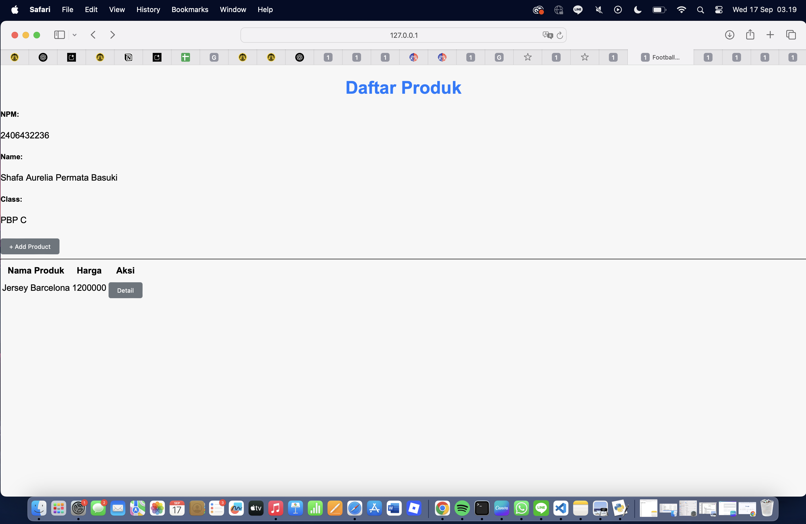
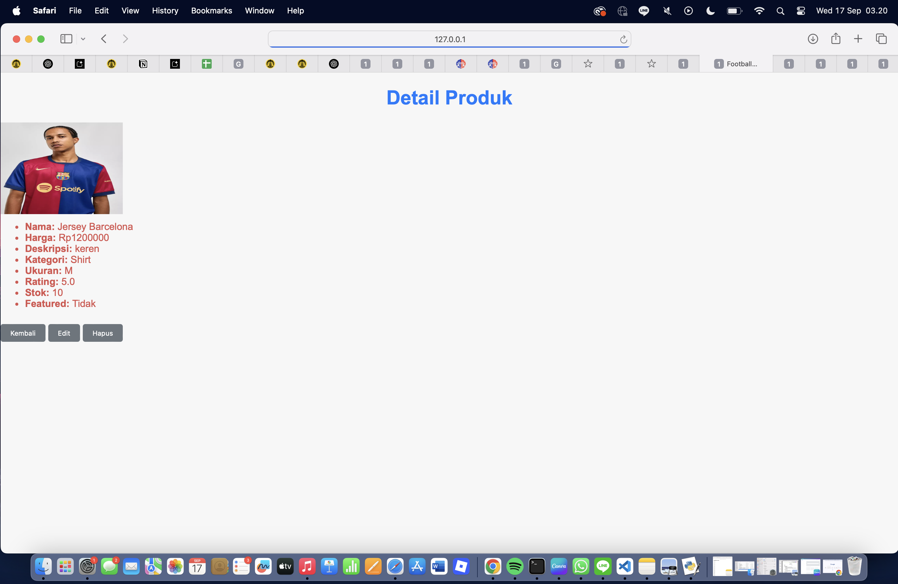
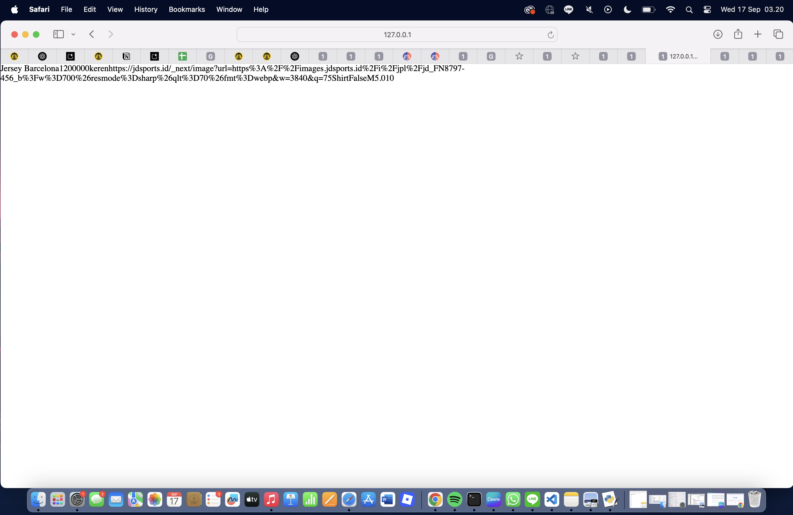
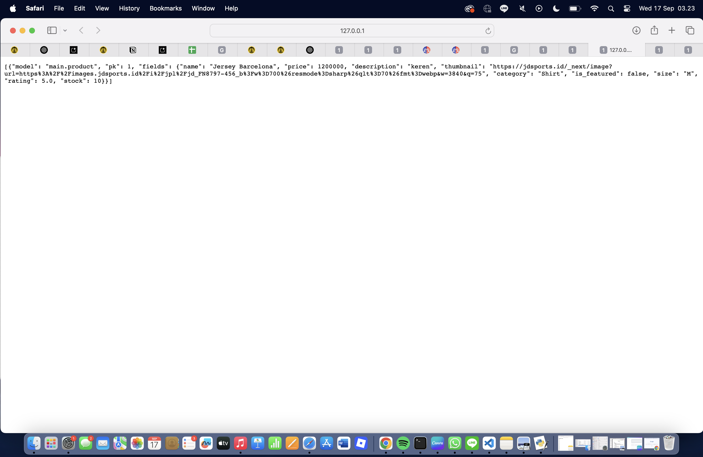
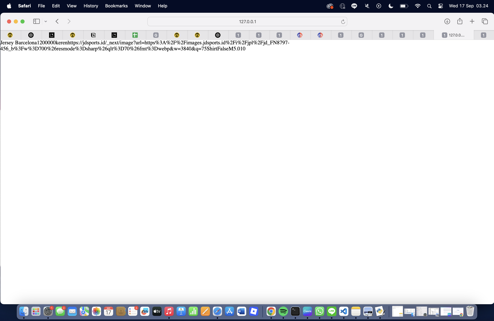
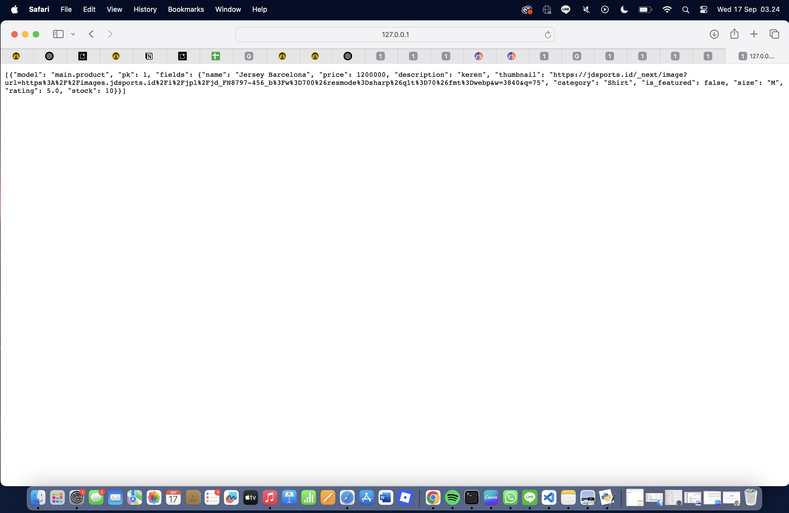

TUGAS 3
SOAL 1:
 Jelaskan mengapa kita memerlukan data delivery dalam pengimplementasian sebuah platform?

 Jawaban: 
 1. Data delivery memastikan komponen-komponen seperti frontend, backend, database, dan layanan pihak ketiga dapat berkomunikasi dan bertukar informasi secara efektif.
 2. Agar pengguna tidak akan mengalami penundaan, kesalahan, atau ketidakmampuan untuk mengakses informasi yang relevan.
 3. Karena sebagian besar fitur aplikasi sangat bergantung pada data yang diterima. Misalnya, menampilkan daftar produk, memproses pesanan, mengirim notifikasi, atau memperbarui profil pengguna.
 4. Data delivery dapat memastikan bahwa semua bagian sistem memiliki versi data terbaru.
 5. Data delivery memfasilitasi pertukaran data yang diperlukan untuk integrasi dengan pihak ketiga seperti pembayaran gateway, API, dll.
 6. Dapat membantu platform untuk menskalakan dan mempertahankan kinerja tinggi seiring dengan pertumbuhan jumlah pengguna dan volume data.

SOAL 2:
 Menurutmu, mana yang lebih baik antara XML dan JSON? Mengapa JSON lebih populer dibandingkan XML?

 Jawaban:
 JSON lebih baik untuk kebanyakan aplikasi web karena lebih ringan, mudah dibaca manusia, dan mudah diproses oleh JavaScript. JSON lebih populer dibandingkan XML karena sintaksnya sederhana, parsing lebih cepat, dan lebih mudah diintegrasikan dengan teknologi web modern.

SOAL 3:
 Jelaskan fungsi dari method is_valid() pada form  Django dan mengapa kita membutuhkan method tersebut?

 Jawaban:
 Fungsi utama dari is_valid() adalah untuk melakukan validasi data yang disubmit oleh pengguna melalui form. is_valid() sangat dibutuhkan untuk menjaga keamanan data, integritas data, dan pencegahan bug.

SOAL 4:
 Mengapa kita membutuhkan csrf_token saat membuat form di Django? Apa yang dapat terjadi jika kita tidak menambahkan csrf_token pada form Django? Bagaimana hal tersebut dapat dimanfaatkan oleh penyerang?

Jawaban:
Untuk melindungi aplikasi dari serangan Cross-Site Request Forgery (CSRF). Jika  tidak menambahkan  pada form Django, aplikasi Anda akan rentan terhadap serangan CSRF, yang berarti permintaan POST tanpa proteksi, dan akan ditolak secara default oleh Django. Serangan CSRF terjadi ketika penyerang dapat menipu browser pengguna yang sudah terautentikasi ke situs web Anda untuk mengirimkan permintaan HTTP (biasanya POST) yang tidak diinginkan ke situs kita.

SOAL 5:
 Jelaskan bagaimana cara kamu mengimplementasikan checklist di atas secara step-by-step (bukan hanya sekadar mengikuti tutorial).
 
  Jawaban:
 1. Buat project & app
 2. Tambahkan main ke settings.py — INSTALLED_APPS.
 3. Rancang model Product (main/models.py) dengan atribut
 4. Buat ProductForm (main/forms.py) sebagai ModelForm untuk validasi dan kemudahan form rendering.
 5. Buat views untuk template
 6. Tambahkan 4 views data delivery
 7. Routing: daftarkan semua URL di main/urls.py lalu include('main.urls') di project/urls.py.
 8. Buat templates
 9. Migrate & test lokal:
 10. Deploy ke PWS
 11. Commit & Push ke GitHub

SOAL 6:
 Apakah ada feedback untuk asdos di tutorial 2 yang sudah kalian kerjakan?

 Jawaban:
 Tambahkan contoh Postman step-by-step (cara cek header & body), dan berikan contoh screenshot hasil yang benar.

HASIL TUGAS 3:

http://127.0.0.1:8000/

http://127.0.0.1:8000/xml/

http://127.0.0.1:8000/json/

http://127.0.0.1:8000/xml/1/

http://127.0.0.1:8000/json/1/

TUGAS 4
SOAL 1:
 Apa itu Django AuthenticationForm? Jelaskan juga kelebihan dan kekurangannya.

 Jawaban: 
 => AuthenticationForm adalah form bawaan Django untuk proses login (username + password). Form ini melakukan validasi input (cek user ada, password cocok) dan menyediakan method get_user() untuk mengambil objek user yang tervalidasi.

 => Kelebihan:
 1. Siap pakai dan teruji
 2. Terintegrasi langsung dengan sistem auth Django (backends, hashing password, validators).
 3. Otomatis menampilkan error message yang sesuai (invalid login, inactive user).
 4. Aman: memanfaatkan mekanisme password hashing & policy Django.

 => Kekurangan:
 1. Struktur field-nya terbatas (hanya username & password) — tidak cocok bila pakai custom user model yang pakai email sebagai identifier tanpa dimodifikasi.
 2. Tidak menyediakan fitur tingkat lanjut (mis. OTP, 2FA, email verification, remember-me) — harus dikembangkan sendiri atau pakai paket eksternal.
 3. UX minimal; jika butuh layout khusus / field tambahan, kamu harus subclass atau buat custom form.

Referensi: https://www.jagoanhosting.com/blog/django/#apa-itu-django

SOAL 2:
 Apa perbedaan antara autentikasi dan otorisasi? Bagaiamana Django mengimplementasikan kedua konsep tersebut?

 Jawaban:
 => Authentication:
 "Usernya siapa?"
 Proses verifikasi identitas user (username/password, token, OAuth, dll).
 Di Django: django.contrib.auth menyediakan model User, fungsi authenticate() untuk memeriksa kredensial, dan login() untuk membuat session pengguna.

 => Authorization:
 "memverifikasi apakah bisa mengakses sesuatu atau tidak"git status

 pemeriksaan hak akses (permissions, group, role).
 Di Django: permission system (user.has_perm('app_label.codename')), decorator @permission_required, atribut is_staff/is_superuser, dan grup (Group) untuk mengelompokkan permission.

 => Cara Django menghubungkan keduanya
 1. User diautentikasi (login) → Django membuat session dan menyimpan session id di cookie (server-side session by default).
 2. Saat permintaan berikutnya, Django memuat request.user dari session.
 3. Untuk otorisasi, developer memanggil request.user.has_perm(...), @login_required, @permission_required, atau memeriksa atribut is_staff/is_superuser.

Referensi: https://www.ibm.com/id-id/think/topics/authentication-vs-authorization

SOAL 3:
 Apa saja kelebihan dan kekurangan session dan cookies dalam konteks menyimpan state di aplikasi web?

 Jawaban:
 => Cookies (client-side)
 Kelebihan:
 1. Persisten di client (dapat bertahan antar-sesi jika di-set).
 2. Mudah dipakai untuk preference / small flags (mis. theme, last_visit).
 3. Tidak memerlukan penyimpanan server tambahan jika datanya sederhana.

 Kekurangan:
 1. Ukuran terbatas (~4 KB).
 2. Rentan dimanipulasi/diintip jika tidak diamankan (XSS, cookie theft).
 3. Menambah overhead request (kirim setiap HTTP request).

 => Sessions (server-side, umum di Django)
 Kelebihan:
 1. Data tersimpan di server (db/cache/file) → lebih aman untuk data sensitif.
 2. Bisa menyimpan data besar (lebih dari 4KB) tanpa membebani cookie.
 3. Session id saja dikirim ke client (lebih kecil & aman).

 Kekurangan:
 1. Membutuhkan penyimpanan server (skalabilitas/performance perlu dipertimbangkan).
 2. Jika menggunakan DB default, skalabilitas horizontal perlu konfigurasi (shared session store atau cache/redis).
 3. Pengaturan masa hidup & cleaning (expired sessions) perlu diperhatikan.

 Intinya:
 Gunakan cookies untuk small, non-sensitive client preferences; gunakan session untuk informasi autentikasi & data sensitif.

 Referensi:
 https://www.hostinger.com/id/tutorial/cookies-adalah?utm_medium=ppc&utm_campaign=Generic-Tutorials-DSA%7CNT:Se%7CLO:ID&gad_source=1&gad_campaignid=16000629991&gbraid=0AAAAADMy-hauOKKJTZt6Pkz0xaiGmAoy7&gclid=Cj0KCQjw58PGBhCkARIsADbDilzCf7Ju1A4onKSkkgCbnMAU_wwhSkNtiOJcCwfylf8hUtToUefkZ6gaAgA4EALw_wcB

SOAL 4:
 Apakah penggunaan cookies aman secara default dalam pengembangan web, atau apakah ada risiko potensial yang harus diwaspadai? Bagaimana Django menangani hal tersebut?

 Jawaban:
 => Risiko utama: 
 - XSS (Cross-Site Scripting): skrip jahat di halaman dapat membaca cookie jika cookie tidak HttpOnly.
 - CSRF (Cross-Site Request Forgery): permintaan dari domain lain bisa memanfaatkan cookie session untuk melakukan aksi atas nama user.
 - MITM (Man-in-the-Middle): cookie bisa diintip kalau koneksi tidak HTTPS.
 - Manipulasi: jika data disimpan langsung di cookie tanpa penandatanganan/enkripsi.

 => Cara Django Menangani:
 - Session server-side (default django.contrib.sessions.backends.db) → cookie hanya berisi session id (lebih aman).
 - SESSION_COOKIE_HTTPONLY = True (default) → mencegah akses cookie via JavaScript.
 - CSRF protection (django.middleware.csrf.CsrfViewMiddleware) → token CSRF otomatis & templatetag .
 - SESSION_COOKIE_SECURE / CSRF_COOKIE_SECURE: set True di produksi untuk hanya mengirim lewat HTTPS.
 - SESSION_COOKIE_SAMESITE: atur Lax atau Strict untuk mitigasi CSRF terkait cross-site.
 - Signed cookies: Django menyediakan mekanisme penandatanganan cookie (jika memakai signed cookie session backend) sehingga server bisa memverifikasi isi cookie.
 - Pakai HTTPS di produksi (set SESSION_COOKIE_SECURE = True).
 - Biarkan SESSION_COOKIE_HTTPONLY = True.
 - Aktifkan CSRF middleware dan gunakan  pada form POST.
 - Hindari menyimpan data sensitif langsung di cookie; jika perlu, gunakan signed/encrypted cookie atau server-side session.

 Referensi:
 https://www.totalit.co.id/blog/mengenal-cookies-browser-fungsi-bahaya-dan-cara-mengelolanya

SOAL 5:
 Jelaskan bagaimana cara kamu mengimplementasikan checklist di atas secara step-by-step (bukan hanya sekadar mengikuti tutorial).

 1) Model: hubungkan Product ke User
 - Tujuan: setiap product mempunyai owner (user).
 - Untuk migrasi yang aman (kalau DB sudah ada data), sementara beri null=True, blank=True lalu setelah data bersih boleh diubah menjadi non-nullable.
 2) Forms: buat ProductForm di main/forms.py
 - Tujuan: agar menghasilkan bentuk input yang bersih, validasi otomatis, dan mudah dipakai di create_product.
 3) Views: register / login / logout / show_main / create_product di main/views.py
 4) Di football_shop/urls.py pastikan include: path('', include('main.urls')),
 5) Templates (penting: selalu gunakan  pada form)
 6) Migrasi & menangani data lama: Jika migrasi menolak karena mengubah field yang tadinya nullable → dua jalan:
    - Beri default sekarang saat makemigrations (one-off default)
    - Biarkan null=True dulu lalu migrasi, bersihkan data, kemudian ubah ke non-nullable
 7) Buat 2 akun dan 3 dummy product per akun, punya saya:
 Product.objects.create(user=user1, name='Sepatu Bola', price=500000, description='Sepatu bola', thumbnail='http://example.com/sepatu.jpg', category='Sepatu', stock=10)
 Product.objects.create(user=user1, name='Jersey Timnas', price=350000, description='Jersey', thumbnail='http://example.com/jersey.jpg', category='Pakaian', stock=5)
 Product.objects.create(user=user1, name='Socks Panjang', price=50000, description='Kaos kaki', thumbnail='http://example.com/socks.jpg', category='Aksesoris', stock=20)

 Product.objects.create(user=user2, name='Bola Adidas', price=600000, description='Bola', thumbnail='http://example.com/bola.jpg', category='Peralatan', stock=15)
 Product.objects.create(user=user2, name='Sarung Tangan Kiper', price=200000, description='Gloves', thumbnail='http://example.com/gloves.jpg', category='Aksesoris', stock=8)
 Product.objects.create(user=user2, name='Training Cones', price=100000, description='Cones', thumbnail='http://example.com/cones.jpg', category='Peralatan', stock=30)
 8) Testing manual & pengecekan
 9) Commit & push ke GitHub
 
